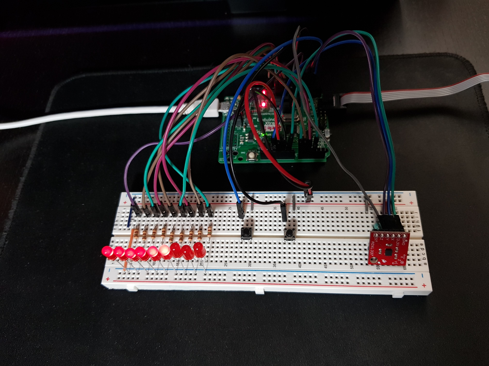
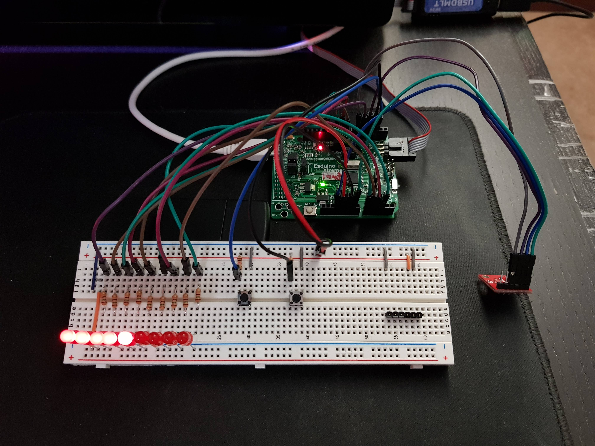
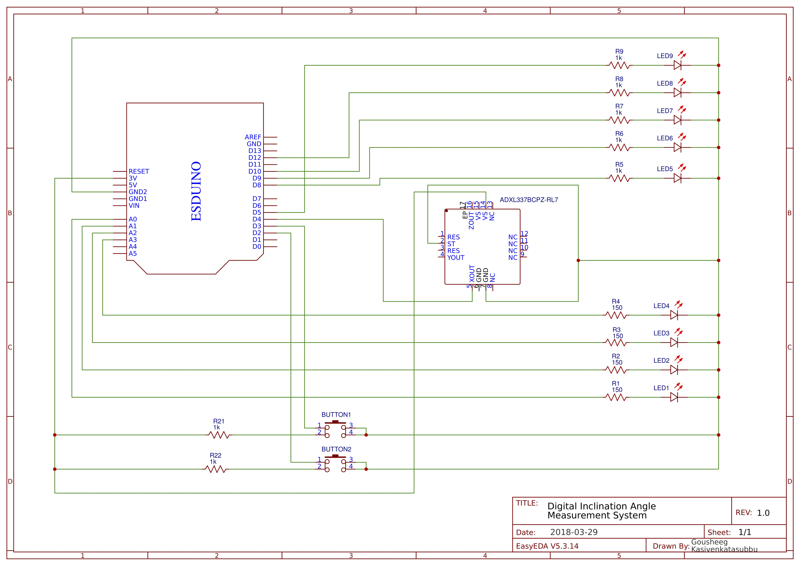
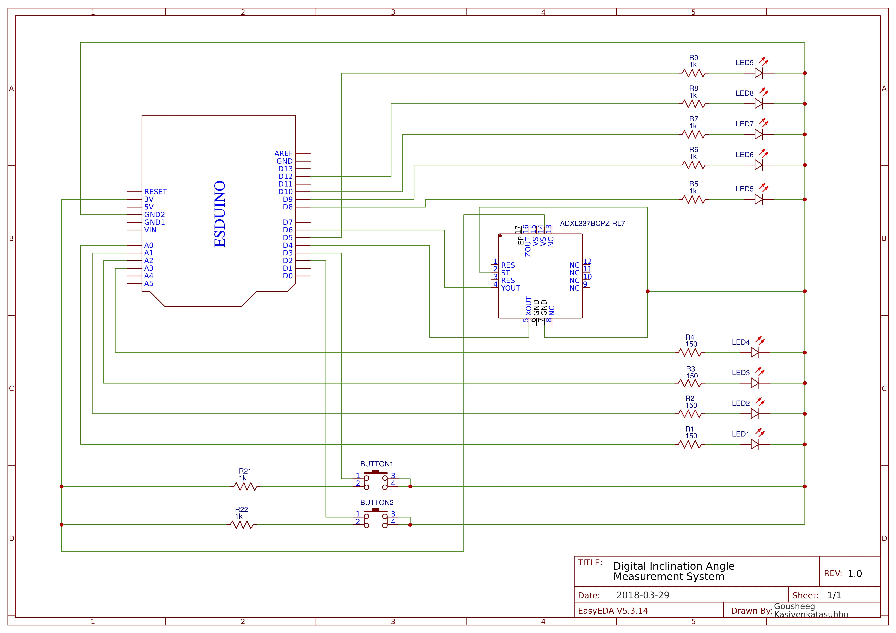

# Data Acquisiton-System: Inclination Angle System

This was a project for my microprocessors course. The system is based on the EsduinoExtreme and is used to obtain the angle of inclicnation using data from the accelerometer ADXL337. It involved configuring the EsduinoExtreme to receive analog data from the accelerometer and convert this data to its digital equivalent and then process it to compute the angle the angle of inclination. This data is then used to light up an array of LEDs which light up as the angle progresses form 0 to 90 degrees. The data is also serially sent back to the computer and is graphed using MATLAB. 

## Parts Required:
* Esduino Extreme
* Breadboard
* LEDs
* Pushbuttons
* Resistors
* Jumper wires
* Sparkfun ADXL337 Triple Axis Accelerometer

### Circuit in MODE 0 representing angle as Binary Code Decimal:

### Circuit in MODE 1 representing angle in 10 degree increments:

## Circuit Schematics:
##### Data from x axis only:

##### Data from x and y axis:

