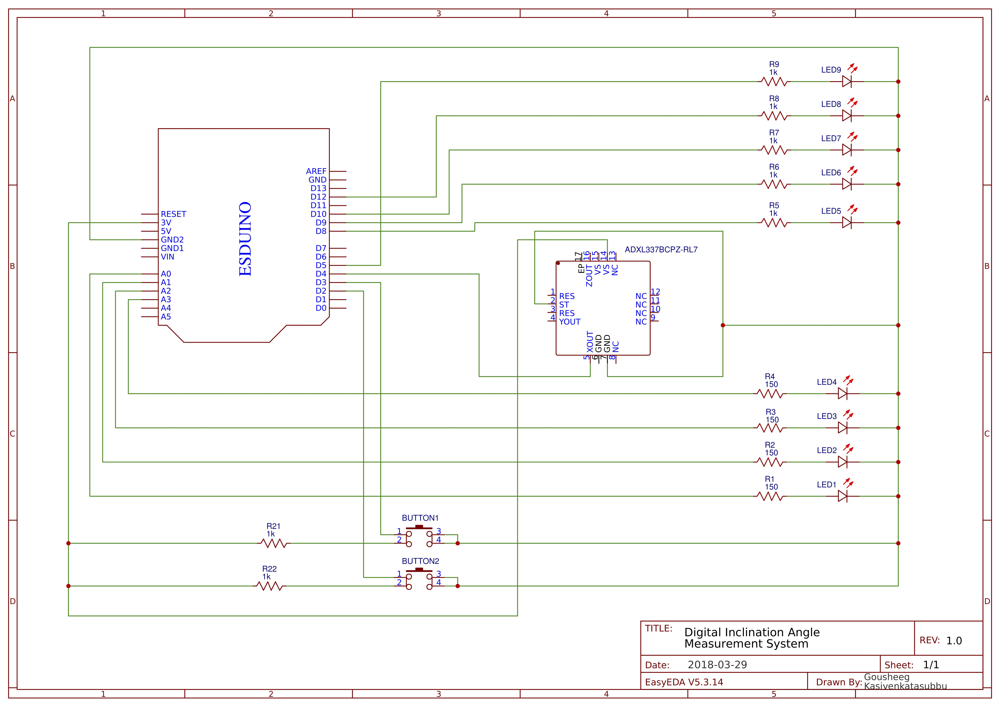
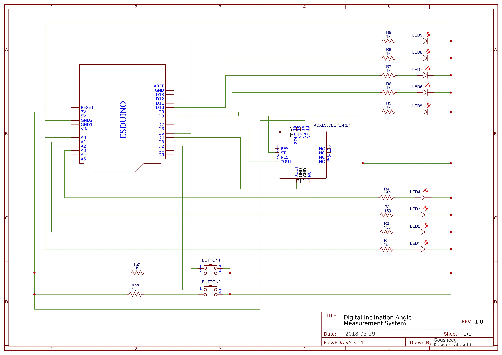

# Data Acquisiton-System: Inclination Angle System

## Parts Required:
* Esduino Extreme
* Breadboard
* LEDs
* Pushbuttons
* Resistors
* Jumper wires
* Sparkfun ADXL337 Triple Axis Accelerometer

## Circuit Schematics:

